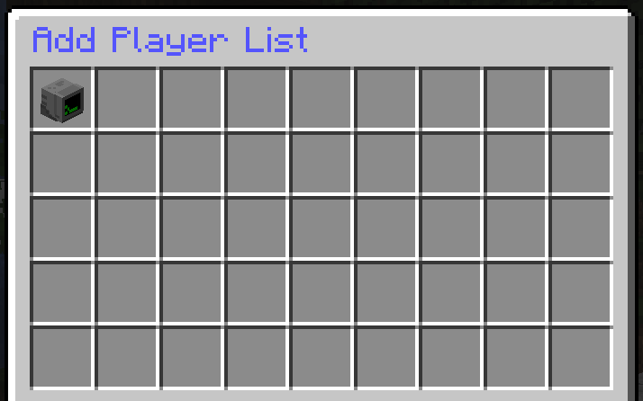
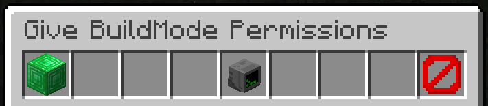
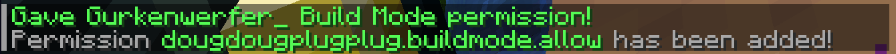
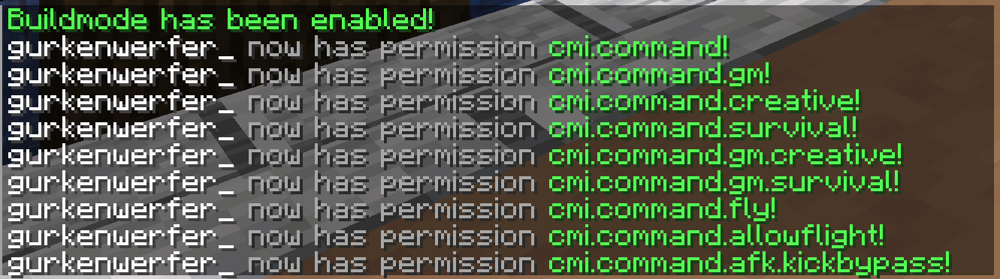
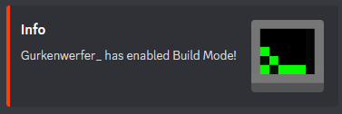

<br/>
<p align="center">
  <a href="https://github.com/ShaanCoding/ReadME-Generator">
    
  </a>

<h3 align="center">DougDougPlugPlug</h3>

  <p align="center">
    A small custom Minecraft permission management system.
    <br/>
    <br/>
    <a href="https://github.com/ShaanCoding/ReadME-Generator/issues">Report Bug</a>
    .
    <a href="https://github.com/ShaanCoding/ReadME-Generator/issues">Request Feature</a>
  </p>
</p>

    
   [](https://www.dougdoug.com/minecraft)

## Table Of Contents

* [About the Project](#about-the-project)
* [Getting Started](#getting-started)
    * [Installation](#installation)
* [Usage](#usage)
 * [Discord Webhook](#discord-webhook)
* [Contributing](#contributing)
* [License](#license)
* [Acknowledgements](#acknowledgements)

## Getting Started

If you want Discord Notifications if a user changes into Build Mode, enter your Webhook-URL in the config.yml file.

### Installation

1. Place the .jar in your plugins directory.
2. Type stop in your Minecraft server console to bring the server to a clean stop.
3. Run the server.


All done!
Your plugin should be installed and ready to be used.

## Usage

Players who should be allowed to grant other players specific permissions need the  
  
`dougdougplugplug.buildmode.admin`  
  
permission node set to "true" for them.

To grant players specific permissions e.g. creative mode, use the command `/buildmode add` or `/bm add`.  
A GUI with all online players (who do not have the mode enabled for them already) will appear.



Click the player you want to grant permissions. A confirmation GUI appears.



Confirm and exit the GUI.



A set of default permissions will be added to the `buildModePerms.yml` config file in the `/plugins/DougDougPlugPlug` folder for each player you grant permission.  
You can add or remove permissions for each player in this file individually.

```yaml
Gurkenwerfer_:
- cmi.command
- cmi.command.gm
- cmi.command.creative
- cmi.command.survival
- cmi.command.gm.creative
- cmi.command.gm.survival
- cmi.command.fly
- cmi.command.allowflight
```

Once a player received your permission to enter "build mode", he can use the command `/bm` to toggle their set of permissions on and off.



Remove permissions for the build mode from a player the same way you've given it to them using the command `/bm remove`. Once you've removed a player from the list, his gamemode will be set to survival.


## Discord Webhook



If you want to receive a Discord message via Webhook every time a player enters build mode, set your webhook URL in the `config.yml` file, also found in `/plugins/DougDougPlugPlug`.


  
  

### Creating A Pull Request

1. Fork the Project
2. Create your Feature Branch (`git checkout -b feature/AmazingFeature`)
3. Commit your Changes (`git commit -m 'Add some AmazingFeature'`)
4. Push to the Branch (`git push origin feature/AmazingFeature`)
5. Open a Pull Request

## License

Distributed under the MIT License. See [LICENSE](https://github.com/stefexec/DougDougPlugPlug/blob/main/LICENSE.md) for more information.

## Acknowledgements

* [Gurkenwerfer_](https://github.com/stefexec/)

